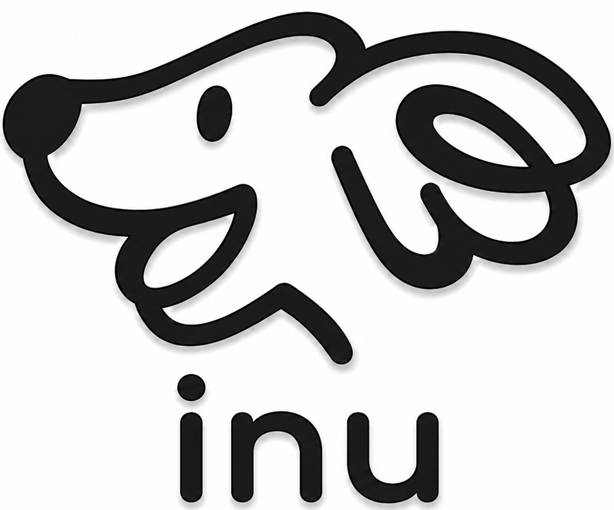
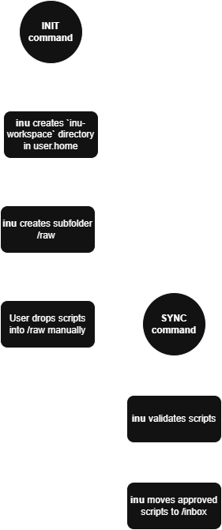

  

 <strong> The watchdog of your scripts </strong>

  
  
  
  

## About me

<strong>inu</strong> is a lightweight automation framework built with native Java, Apache Commons libraries, and Log4j2 designed around structured execution logging and full workflow traceability. Every action including running, deleting, organizing or scheduling scripts is tracked through dynamic weekly logs providing clear visibility of system behavior successes and failures.
It provides a centralized workspace for managing Python PowerShell and Shell scripts through a controlled automation pipeline combining organization execution and monitoring in a single environment.

## Core Features

- Script Visualization: View scripts by tag folders, pending status, or across the entire workspace.
- Execution Modes: Dual mode system with both interactive CLI and direct CLI commands.
- Dynamic Logging: Weekly structured logs tracking all executions, errors, and system events.
- Windows Task Scheduling: Native scheduling support without requiring administrator privileges.
- Workspace Synchronization: Automatic setup and intelligent organization of the workspace environment.
- Raw-to-Inbox Pipeline: Simple ingestion system where scripts dropped into `raw` are validated and routed to `inbox`.
- Multi-Language Support: Executes and manages Python, PowerShell, and Shell scripts in a unified workspace.

## Requirements

* **Operating System:** Windows 10, Windows 11 or Linux.
  
* **Recommended Storage:** SSD.
  
> [!IMPORTANT]
> Task scheduling support in the current pre-release version is currently available only on Windows.

## First use

a. In the Interactive CLI Mode, enter `init` to create the `inu-workspace` folder, or use:
`java -jar app\inu.jar init`

> You will see the `inu-workspace` directory created in `user.home`, containing the folders `inbox`, `raw`, `scripts`,
> and additional subfolders that act as tag folders, allowing you to organize your scripts based on their purpose.

b. After that, you can **manually** place any scripts you want into the `raw` folder. Once done, you can return to the CLI.

c. Now you can run `sync` or `java -jar app\inu.jar sync`, and all approved scripts will be moved into the `inbox` folder.

<strong>For more details, see the flow diagram:</strong>

  

## Daily use
a. How to move a script to a tag folder:  
Interactive CLI Mode: Enter `move`  
Input: `scriptname.extension tagfoldername`  
CLI mode: `java -jar app\inu.jar move scriptname.extension tagfoldername`

b. How to run a script:  
Interactive CLI Mode: Enter `run`  
Input: `scriptname.extension tagfoldername`  
CLI mode: `java -jar app\inu.jar run scriptname.extension tagfoldername`

c. How to delete a script:  
Interactive CLI Mode: Enter `del`  
Input: `scriptname.extension tagfoldername`  
CLI mode: `java -jar app\inu.jar del scriptname.extension tagfoldername`

d. How to schedule a script (task):  
Interactive CLI Mode: Enter `task`  
Input: `scriptname.extension tagfoldername timing frequency`  
CLI mode: `java -jar app\inu.jar task scriptname.extension tagfoldername timing frequency`

e. How to view help menu:  
  **Interactive CLI Mode:** Input `help`  
  **CLI Mode:** `java -jar app\inu.jar help`
  
f. How to list scripts (3 ways):

- To view all scripts across all folders:  
  **Interactive CLI Mode:** Enter `list` → Input: `all`  
  **CLI Mode:** `java -jar app\inu.jar list all`

- To view only pending scripts in inbox:  
  **Interactive CLI Mode:** Enter `list` → Input: `pending`  
  **CLI Mode:** `java -jar app\inu.jar list pending`

- To view scripts in a specific tag folder:  
  **Interactive CLI Mode:** Enter `list` → Input: `tag` → `tagfoldername`  
  **CLI Mode:** `java -jar app\inu.jar list tag tagfoldername`
  

## Next Implementations

🐾 Graphical interface for the Interactive CLI Mode while keeping the CLI Mode fully functional.

🐾 Hybrid database system to manage script metadata, improving indexing, search, and organization across the workspace.

🐾 Logging improvements focused on better structure, clarity, and deeper execution traceability across all operations.

🐾 Expanded Linux support with integration for `cron`, enabling task scheduling compatibility across Linux environments.
